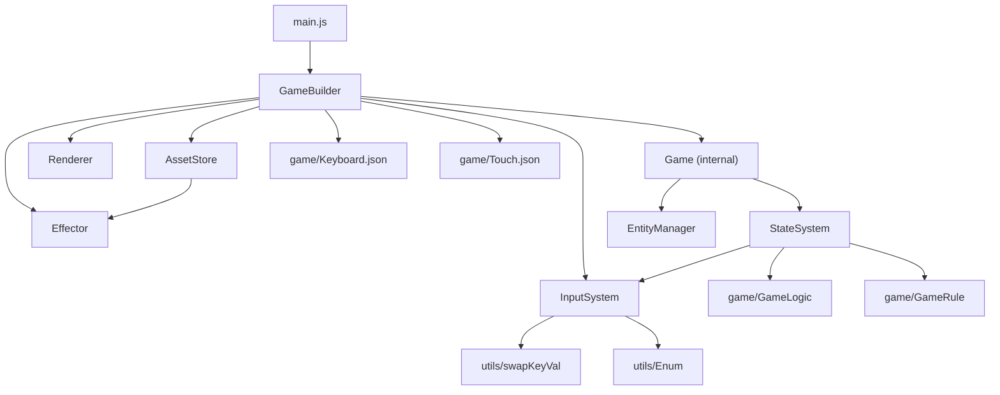
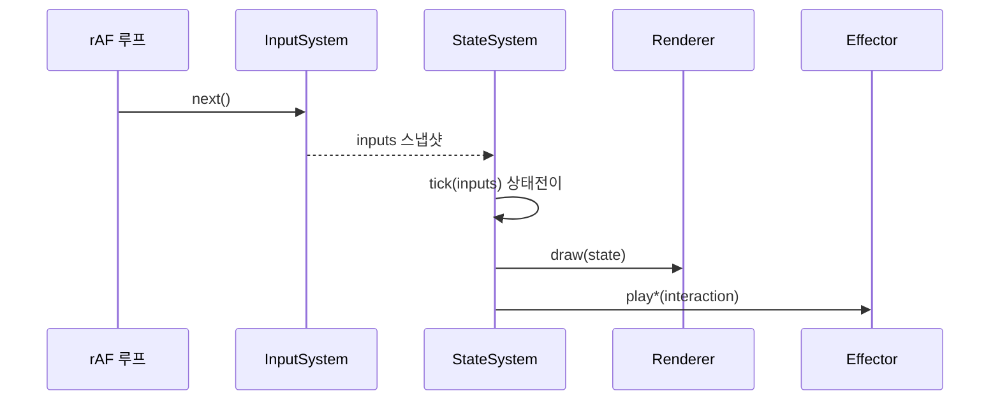

# 하이큐 배구

피카츄 배구를 벤치마킹한 순수 HTML/CSS/JS PWA 게임.

---

## 모듈 방향 그래프

---

## 레이어 규칙

| 접미사 | 역할 | 틱 종속 |
|--------|------|---------|
| `er` (Renderer, Effector) | 출력·소비 | Renderer=O, Effector=X |
| `System` (InputSystem, StateSystem) | 입력·생산 (스트림) | O |
| `Manager` (EntityManager) | 동적 등록/삭제 | X |
| `Store` (AssetStore) | 읽기전용 데이터 보관 | X |
| `Builder` (GameBuilder) | 초기화·조립 | X |

---

## 1틱 데이터 흐름

